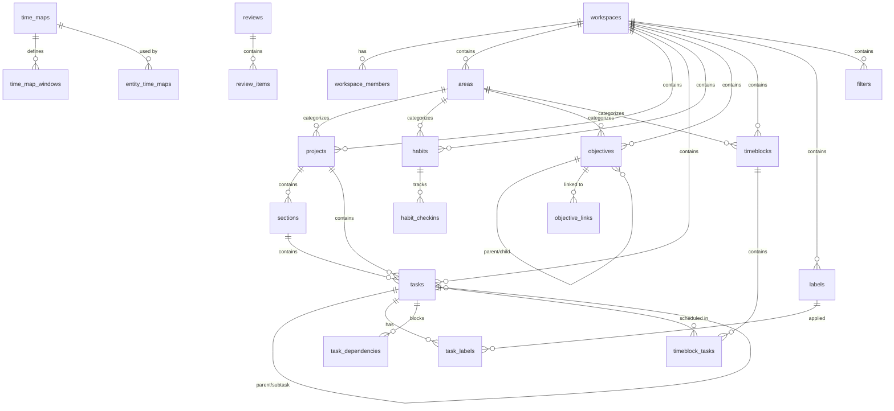

# Alynea Database Schema

> **Extracted from Supabase project `mlvxouksrlergxgcxxby`**  
> Last updated: 2026-01-08

This document provides a comprehensive overview of the Alynea task management database schema, including all tables, relationships, Row-Level Security (RLS) policies, and trigger functions.

## Table of Contents

- [Architecture Overview](#architecture-overview)
- [Entity Relationship Diagram](#entity-relationship-diagram)
- [Core Entities](#core-entities)
- [RLS Security Model](#rls-security-model)
- [Trigger Functions](#trigger-functions)
- [Quick Reference](#quick-reference)

---

## Architecture Overview

Alynea uses a **workspace-based multi-tenant architecture** where all data is scoped to workspaces. Users access data through workspace memberships.

```
┌─────────────────────────────────────────────────────────────────┐
│                        auth.users                                │
│                    (Supabase Auth)                               │
└───────────────────────────┬─────────────────────────────────────┘
                            │
                            ▼
┌─────────────────────────────────────────────────────────────────┐
│                    workspace_members                             │
│         (user_id, workspace_id, role: owner|admin|member)        │
└───────────────────────────┬─────────────────────────────────────┘
                            │
                            ▼
┌─────────────────────────────────────────────────────────────────┐
│                       workspaces                                 │
│              (Multi-tenant isolation boundary)                   │
└───────────────────────────┬─────────────────────────────────────┘
                            │
        ┌───────────────────┼───────────────────────┐
        ▼                   ▼                       ▼
   ┌─────────┐        ┌──────────┐           ┌───────────┐
   │  Tasks  │        │ Projects │           │  Habits   │
   │ Labels  │        │ Sections │           │ Checkins  │
   │ Deps    │        │ Folders  │           └───────────┘
   └─────────┘        └──────────┘
        │                   │
        └───────────────────┼───────────────────────┐
                            ▼                       ▼
                     ┌────────────┐          ┌────────────┐
                     │ Timeblocks │          │ Objectives │
                     │ Time Maps  │          │ Reviews    │
                     └────────────┘          └────────────┘
```

### Key Principles

1. **Workspace Isolation**: All user data is scoped to workspaces
2. **RLS Enforcement**: Every table has Row-Level Security enabled
3. **Referential Integrity**: Trigger functions validate workspace alignment across relationships
4. **Soft Deletes**: Cascade deletions with `ON DELETE CASCADE` for most relationships

---

## Entity Relationship Diagram



---

## Core Entities

### Workspaces & Access Control

#### `workspaces`
The top-level multi-tenant container.

| Column | Type | Default | Description |
|--------|------|---------|-------------|
| `id` | uuid | `gen_random_uuid()` | Primary key |
| `name` | text | NOT NULL | Workspace display name |
| `slug` | text | NOT NULL, UNIQUE | URL-friendly identifier |
| `created_at` | timestamptz | `now()` | Creation timestamp |
| `updated_at` | timestamptz | `now()` | Last update timestamp |

#### `workspace_members`
Junction table linking users to workspaces with roles.

| Column | Type | Default | Constraints |
|--------|------|---------|-------------|
| `id` | uuid | `gen_random_uuid()` | Primary key |
| `workspace_id` | uuid | NOT NULL | FK → workspaces |
| `user_id` | uuid | NOT NULL | FK → auth.users |
| `role` | text | NOT NULL | `owner` \| `admin` \| `member` |
| `joined_at` | timestamptz | `now()` | Join timestamp |

**Unique constraint**: `(workspace_id, user_id)`

---

### User Profiles

#### `profiles`
Basic user profile (auto-created on signup via trigger).

| Column | Type | Description |
|--------|------|-------------|
| `id` | uuid | PK, FK → auth.users |
| `display_name` | text | User's display name |
| `updated_at` | timestamptz | Last update |

#### `user_profiles`
Extended user preferences.

| Column | Type | Default | Description |
|--------|------|---------|-------------|
| `user_id` | uuid | PK, FK → auth.users | User reference |
| `email` | text | NOT NULL | User email |
| `full_name` | text | | Full name |
| `timezone` | text | `'UTC'` | User timezone |
| `locale` | text | `'en-US'` | Preferred locale |
| `start_of_week` | text | `'monday'` | Week start preference |
| `theme` | text | `'system'` | UI theme preference |

---

### Task Management

#### `tasks`
The core task entity with rich metadata.

| Column | Type | Default | Constraints |
|--------|------|---------|-------------|
| `id` | uuid | `gen_random_uuid()` | Primary key |
| `workspace_id` | uuid | NOT NULL | FK → workspaces |
| `project_id` | uuid | | FK → projects (CASCADE) |
| `section_id` | uuid | | FK → sections (SET NULL) |
| `parent_task_id` | uuid | | FK → tasks (self, CASCADE) |
| `title` | text | NOT NULL | Task title |
| `description` | text | | Rich text description |
| `status` | text | `'todo'` | `todo` \| `in_progress` \| `done` \| `canceled` |
| `priority` | smallint | `4` | 1 (highest) to 4 (lowest) |
| `due_type` | text | `'none'` | `none` \| `date` \| `datetime` |
| `due_date` | date | | Due date (when due_type = 'date') |
| `due_datetime` | timestamptz | | Due datetime (when due_type = 'datetime') |
| `start_type` | text | `'none'` | `none` \| `date` \| `datetime` |
| `start_date` | date | | Start date |
| `start_datetime` | timestamptz | | Start datetime |
| `completed_at` | timestamptz | | Completion timestamp |
| `assignee_member_id` | uuid | | FK → workspace_members |
| `duration_minutes` | integer | | Estimated duration |
| `created_at` | timestamptz | `now()` | Creation timestamp |
| `updated_at` | timestamptz | `now()` | Last update |

**Check Constraints**:
- `check_due_date_logic`: Ensures due_type matches due_date/due_datetime presence
- `check_start_date_logic`: Ensures start_type matches start_date/start_datetime presence
- `tasks_priority_check`: priority BETWEEN 1 AND 4
- `tasks_duration_minutes_check`: duration_minutes >= 0 OR NULL

#### `task_dependencies`
Blocking relationships between tasks.

| Column | Type | Default | Constraints |
|--------|------|---------|-------------|
| `blocking_task_id` | uuid | PK | FK → tasks |
| `blocked_task_id` | uuid | PK | FK → tasks |
| `workspace_id` | uuid | NOT NULL | FK → workspaces |
| `dependency_type` | text | `'finish_to_start'` | Dependency type |

**Check**: `blocking_task_id <> blocked_task_id`

#### `task_labels`
Junction table for task-label relationships.

| Column | Type | Description |
|--------|------|-------------|
| `task_id` | uuid | PK, FK → tasks |
| `label_id` | uuid | PK, FK → labels |
| `workspace_id` | uuid | NOT NULL, FK → workspaces |

#### `labels`
Reusable labels for task categorization.

| Column | Type | Default | Description |
|--------|------|---------|-------------|
| `id` | uuid | `gen_random_uuid()` | Primary key |
| `workspace_id` | uuid | NOT NULL | FK → workspaces |
| `name` | text | NOT NULL | Label name |
| `color` | text | | Hex color code |

**Unique Index**: `(workspace_id, lower(name))`

---

### Project Organization

#### `projects`
Container for related tasks.

| Column | Type | Default | Constraints |
|--------|------|---------|-------------|
| `id` | uuid | `gen_random_uuid()` | Primary key |
| `workspace_id` | uuid | NOT NULL | FK → workspaces |
| `folder_id` | uuid | | FK → project_folders |
| `area_id` | uuid | | FK → areas |
| `name` | text | NOT NULL | Project name |
| `description` | text | | Project description |
| `status` | text | `'active'` | `active` \| `archived` \| `on_hold` |
| `default_view` | text | `'list'` | `list` \| `board` \| `calendar` \| `timeline` |
| `sort_order` | bigint | `0` | Display order |

#### `sections`
Subsections within projects.

| Column | Type | Default | Description |
|--------|------|---------|-------------|
| `id` | uuid | `gen_random_uuid()` | Primary key |
| `project_id` | uuid | NOT NULL | FK → projects |
| `workspace_id` | uuid | NOT NULL | FK → workspaces |
| `name` | text | NOT NULL | Section name |
| `sort_order` | bigint | `0` | Display order |
| `is_archived` | boolean | `false` | Archive status |

#### `project_folders`
Grouping for projects.

| Column | Type | Default | Description |
|--------|------|---------|-------------|
| `id` | uuid | `gen_random_uuid()` | Primary key |
| `workspace_id` | uuid | NOT NULL | FK → workspaces |
| `name` | text | NOT NULL | Folder name |
| `color` | text | | Folder color |
| `sort_order` | bigint | `0` | Display order |

#### `areas`
Life areas for high-level categorization.

| Column | Type | Default | Description |
|--------|------|---------|-------------|
| `id` | uuid | `gen_random_uuid()` | Primary key |
| `workspace_id` | uuid | NOT NULL | FK → workspaces |
| `name` | text | NOT NULL | Area name |
| `color` | text | | Area color |
| `icon` | text | | Area icon |
| `order_key` | bigint | `1000` | Display order |
| `is_archived` | boolean | `false` | Archive status |

**Unique constraint**: `(workspace_id, name)`

---

### Time Blocking & Scheduling

#### `timeblocks`
Scheduled time slots.

| Column | Type | Default | Description |
|--------|------|---------|-------------|
| `id` | uuid | `gen_random_uuid()` | Primary key |
| `workspace_id` | uuid | NOT NULL | FK → workspaces |
| `area_id` | uuid | | FK → areas |
| `start_time` | timestamptz | NOT NULL | Block start |
| `end_time` | timestamptz | NOT NULL | Block end |
| `label` | text | | Block label |
| `is_locked` | boolean | `false` | Lock status |
| `source` | text | `'manual'` | Creation source |

**Check**: `end_time > start_time`

#### `timeblock_tasks`
Junction for tasks assigned to timeblocks.

| Column | Type | Default | Description |
|--------|------|---------|-------------|
| `timeblock_id` | uuid | PK | FK → timeblocks |
| `task_id` | uuid | PK | FK → tasks |
| `workspace_id` | uuid | NOT NULL | FK → workspaces |
| `sort_order` | bigint | `0` | Order within block |

#### `time_maps`
Availability templates.

| Column | Type | Default | Description |
|--------|------|---------|-------------|
| `id` | uuid | `gen_random_uuid()` | Primary key |
| `workspace_id` | uuid | NOT NULL | FK → workspaces |
| `name` | text | NOT NULL | Time map name |

#### `time_map_windows`
Availability windows within time maps.

| Column | Type | Default | Constraints |
|--------|------|---------|-------------|
| `id` | uuid | `gen_random_uuid()` | Primary key |
| `time_map_id` | uuid | NOT NULL | FK → time_maps |
| `day_of_week` | integer | NOT NULL | 0 (Sun) - 6 (Sat) |
| `start_time_local` | time | NOT NULL | Window start |
| `end_time_local` | time | NOT NULL | Window end |
| `preference_level` | text | `'allowed'` | `allowed` \| `preferred` \| `avoid` |

**Check**: `end_time_local > start_time_local`

---

### Habits & Objectives

#### `habits`
Recurring behaviors to track.

| Column | Type | Default | Description |
|--------|------|---------|-------------|
| `id` | uuid | `gen_random_uuid()` | Primary key |
| `workspace_id` | uuid | NOT NULL | FK → workspaces |
| `area_id` | uuid | | FK → areas |
| `title` | text | NOT NULL | Habit title |
| `frequency_type` | text | `'daily'` | Frequency pattern |
| `target_count_per_period` | integer | `1` | Target completions |

#### `habit_checkins`
Daily check-in records.

| Column | Type | Default | Constraints |
|--------|------|---------|-------------|
| `id` | uuid | `gen_random_uuid()` | Primary key |
| `habit_id` | uuid | NOT NULL | FK → habits |
| `workspace_id` | uuid | NOT NULL | FK → workspaces |
| `checkin_date` | date | NOT NULL | Check-in date |
| `value` | integer | `1` | Check-in value/count |

**Unique constraint**: `(habit_id, checkin_date)`

#### `objectives`
Goals and outcomes to achieve.

| Column | Type | Default | Constraints |
|--------|------|---------|-------------|
| `id` | uuid | `gen_random_uuid()` | Primary key |
| `workspace_id` | uuid | NOT NULL | FK → workspaces |
| `parent_objective_id` | uuid | | FK → objectives (self) |
| `area_id` | uuid | | FK → areas |
| `title` | text | NOT NULL | Objective title |
| `status` | text | `'on_track'` | `on_track` \| `at_risk` \| `off_track` \| `completed` \| `canceled` |
| `target_date` | date | | Target completion date |
| `metric_type` | text | `'binary'` | Metric type |
| `current_value` | numeric | `0` | Current progress |
| `target_value` | numeric | `100` | Target value |

#### `objective_links`
Links objectives to tasks/projects/habits.

| Column | Type | Default | Description |
|--------|------|---------|-------------|
| `id` | uuid | `gen_random_uuid()` | Primary key |
| `workspace_id` | uuid | NOT NULL | FK → workspaces |
| `objective_id` | uuid | NOT NULL | FK → objectives |
| `entity_id` | uuid | NOT NULL | Linked entity ID |
| `entity_type` | text | NOT NULL | `task` \| `project` \| `habit` |
| `contribution_weight` | numeric | `1.0` | Weight factor |

---

### Reviews & Planning

#### `reviews`
Periodic review sessions.

| Column | Type | Default | Constraints |
|--------|------|---------|-------------|
| `id` | uuid | `gen_random_uuid()` | Primary key |
| `workspace_id` | uuid | NOT NULL | FK → workspaces |
| `period_start` | date | NOT NULL | Review period start |
| `period_end` | date | NOT NULL | Review period end |
| `review_type` | text | NOT NULL | `weekly` \| `monthly` |
| `status` | text | `'in_progress'` | Review status |

#### `review_items`
Individual items reviewed.

| Column | Type | Description |
|--------|------|-------------|
| `id` | uuid | Primary key |
| `review_id` | uuid | FK → reviews |
| `entity_type` | text | `task` \| `project` \| `objective` |
| `entity_id` | uuid | Referenced entity |
| `decision` | text | Review decision |
| `notes` | text | Review notes |

#### `plan_snapshots`
Point-in-time plan captures.

| Column | Type | Description |
|--------|------|-------------|
| `id` | uuid | Primary key |
| `workspace_id` | uuid | FK → workspaces |
| `snapshot_date` | timestamptz | Snapshot timestamp |
| `content` | jsonb | Serialized plan data |

---

### Filters & Views

#### `filters`
Saved search filters.

| Column | Type | Default | Description |
|--------|------|---------|-------------|
| `id` | uuid | `gen_random_uuid()` | Primary key |
| `workspace_id` | uuid | NOT NULL | FK → workspaces |
| `name` | text | NOT NULL | Filter name |
| `query` | text | NOT NULL | Filter query/definition |
| `color` | text | | Filter color |
| `icon` | text | | Filter icon |
| `is_favorite` | boolean | `false` | Pinned status |
| `position` | integer | `0` | Display position |

#### `view_orderings`
User-specific ordering preferences.

| Column | Type | Description |
|--------|------|-------------|
| `id` | uuid | Primary key |
| `user_id` | uuid | FK → auth.users |
| `context_key` | text | View context identifier |
| `ordered_ids` | uuid[] | Ordered entity IDs |

---

### External Integrations

#### `external_accounts`
OAuth connections (Google, etc.).

| Column | Type | Description |
|--------|------|-------------|
| `id` | uuid | Primary key |
| `user_id` | uuid | FK → auth.users |
| `provider` | text | Provider name |
| `access_token` | text | OAuth access token |
| `refresh_token` | text | OAuth refresh token |
| `expires_at` | timestamptz | Token expiry |
| `metadata` | jsonb | Additional provider data |

#### `external_event_links`
Links between timeblocks and external calendar events.

| Column | Type | Description |
|--------|------|-------------|
| `id` | uuid | Primary key |
| `workspace_id` | uuid | FK → workspaces |
| `timeblock_id` | uuid | FK → timeblocks |
| `external_account_id` | uuid | FK → external_accounts |
| `external_event_id` | text | External system ID |
| `sync_hash` | text | Sync state hash |
| `last_synced_at` | timestamptz | Last sync time |

#### `recurrence_rules`
RRULE patterns for recurring entities.

| Column | Type | Description |
|--------|------|-------------|
| `id` | uuid | Primary key |
| `workspace_id` | uuid | FK → workspaces |
| `entity_type` | text | Entity type |
| `entity_id` | uuid | Entity reference |
| `rrule_string` | text | iCal RRULE string |
| `next_occurrence` | timestamptz | Next computed occurrence |

---

### Audit & Logging

#### `audit_logs`
System-wide audit trail.

| Column | Type | Description |
|--------|------|-------------|
| `id` | uuid | Primary key |
| `workspace_id` | uuid | FK → workspaces |
| `actor_id` | uuid | User who performed action |
| `action` | text | Action type |
| `entity_type` | text | Affected entity type |
| `entity_id` | uuid | Affected entity ID |
| `diff` | jsonb | Change diff |
| `occurred_at` | timestamptz | Action timestamp |

#### `decision_logs`
Record of decisions made on entities.

| Column | Type | Description |
|--------|------|-------------|
| `id` | uuid | Primary key |
| `workspace_id` | uuid | FK → workspaces |
| `entity_type` | text | Entity type |
| `entity_id` | uuid | Entity ID |
| `decision` | text | Decision made |
| `reason` | text | Decision rationale |
| `decided_by` | uuid | User who decided |
| `decided_at` | timestamptz | Decision timestamp |

---

## RLS Security Model

All tables have Row-Level Security (RLS) **enabled**. The security model uses a helper function for consistent workspace-based access control.

### Core Security Function

```sql
CREATE FUNCTION is_workspace_member(_workspace_id UUID) 
RETURNS BOOLEAN AS $$
BEGIN
  RETURN EXISTS (
    SELECT 1 FROM workspace_members 
    WHERE workspace_id = _workspace_id 
    AND user_id = auth.uid()
  );
END;
$$ LANGUAGE plpgsql SECURITY DEFINER;
```

### Policy Categories

#### 1. Workspace-Scoped Tables (Tenant Access)

Most tables use a simple `tenant_access` policy:

```sql
CREATE POLICY "tenant_access" ON <table>
  USING (is_workspace_member(workspace_id));
```

**Tables using this pattern**:
- `areas`, `projects`, `sections`, `tasks`
- `habits`, `habit_checkins`, `objectives`, `objective_links`
- `timeblocks`, `timeblock_tasks`, `time_maps`
- `labels`, `task_labels`, `filters`
- `reviews`, `plan_snapshots`, `recurrence_rules`
- `audit_logs`, `decision_logs`, `entity_time_maps`
- `external_event_links`

#### 2. User-Scoped Tables (Self Access)

Tables scoped to individual users:

```sql
CREATE POLICY "self_access" ON <table>
  USING (user_id = auth.uid());
```

**Tables using this pattern**:
- `user_profiles`
- `external_accounts`
- `view_orderings`

#### 3. Workspace Management

Special policies for workspace CRUD:

| Policy | Operation | Rule |
|--------|-----------|------|
| `workspace_create` | INSERT | Any authenticated user |
| `workspace_select` | SELECT | User is member |
| `workspace_update` | UPDATE | User is member |
| `workspace_delete` | DELETE | User is owner or admin |

#### 4. Workspace Members

| Policy | Operation | Rule |
|--------|-----------|------|
| `workspace_members_select` | SELECT | Own membership |
| `workspace_members_insert` | INSERT | Authenticated user |
| `workspace_members_update` | UPDATE | Own membership |
| `workspace_members_delete` | DELETE | Own membership |

#### 5. Profiles (Public Read)

```sql
-- Anyone can view profiles
CREATE POLICY "Public profiles are viewable by everyone." 
  ON profiles FOR SELECT USING (true);

-- Only self can insert/update
CREATE POLICY "Users can insert their own profile." 
  ON profiles FOR INSERT WITH CHECK (auth.uid() = id);
CREATE POLICY "Users can update own profile." 
  ON profiles FOR UPDATE USING (auth.uid() = id);
```

#### 6. Filters (Full CRUD)

```sql
-- Separate policies for each operation
CREATE POLICY "Users can view filters..." 
  ON filters FOR SELECT 
  USING (EXISTS (SELECT 1 FROM workspace_members...));

CREATE POLICY "Users can insert filters..." 
  ON filters FOR INSERT 
  WITH CHECK (EXISTS (...));

CREATE POLICY "Users can update filters..." 
  ON filters FOR UPDATE 
  USING (EXISTS (...));

CREATE POLICY "Users can delete filters..." 
  ON filters FOR DELETE 
  USING (EXISTS (...));
```

#### 7. Task Dependencies (Full CRUD with IN clause)

```sql
CREATE POLICY "task_dependencies_select" ON task_dependencies 
  FOR SELECT 
  USING (workspace_id IN (
    SELECT workspace_id FROM workspace_members WHERE user_id = auth.uid()
  ));
-- Similar for INSERT, UPDATE, DELETE
```

#### 8. Nested Tables (Join-Based Access)

For tables without direct workspace_id:

```sql
-- time_map_windows: Access via parent time_maps
CREATE POLICY "tenant_access" ON time_map_windows 
  USING (EXISTS (
    SELECT 1 FROM time_maps tm 
    WHERE tm.id = time_map_windows.time_map_id 
    AND is_workspace_member(tm.workspace_id)
  ));

-- review_items: Access via parent reviews
CREATE POLICY "tenant_access" ON review_items 
  USING (EXISTS (
    SELECT 1 FROM reviews r 
    WHERE r.id = review_items.review_id 
    AND is_workspace_member(r.workspace_id)
  ));
```

---

## Trigger Functions

### Workspace Alignment Triggers

These triggers ensure referential integrity across workspace boundaries:

| Trigger | Table | Purpose |
|---------|-------|---------|
| `trg_check_task_workspace` | `tasks` | Validates project, section, and assignee belong to same workspace |
| `trg_check_area_project` | `projects` | Validates area belongs to same workspace |
| `trg_check_area_habit` | `habits` | Validates area belongs to same workspace |
| `trg_check_area_objective` | `objectives` | Validates area belongs to same workspace |
| `trg_check_area_timeblock` | `timeblocks` | Validates area belongs to same workspace |
| `trg_check_section_workspace` | `sections` | Validates project belongs to same workspace |
| `trg_check_dependency_alignment` | `task_dependencies` | Validates both tasks belong to same workspace |
| `trg_check_task_label` | `task_labels` | Validates task and label belong to same workspace |
| `trg_check_timeblock_task` | `timeblock_tasks` | Validates timeblock and task belong to same workspace |
| `trg_check_habit_checkin` | `habit_checkins` | Validates habit belongs to same workspace |
| `trg_check_entity_time_map` | `entity_time_maps` | Validates time map and entity belong to same workspace |
| `trg_check_review_item` | `review_items` | Validates review and entity belong to same workspace |

### Utility Triggers

| Trigger | Table | Purpose |
|---------|-------|---------|
| `handle_updated_at` | `filters` | Auto-updates `updated_at` on changes |
| `update_updated_at_areas` | `areas` | Auto-updates `updated_at` on changes |

### Auth Triggers

| Function | Purpose |
|----------|---------|
| `handle_new_user()` | On new user signup: creates profile, default workspace, and owner membership |
| `create_workspace_for_user()` | Helper to create additional workspaces |

---

## Quick Reference

### Table Count by Category

| Category | Tables |
|----------|--------|
| **Core** | workspaces, workspace_members, profiles, user_profiles |
| **Tasks** | tasks, task_labels, task_dependencies, labels |
| **Projects** | projects, sections, project_folders, areas |
| **Time** | timeblocks, timeblock_tasks, time_maps, time_map_windows |
| **Goals** | habits, habit_checkins, objectives, objective_links |
| **Reviews** | reviews, review_items, plan_snapshots |
| **Views** | filters, view_orderings |
| **Integration** | external_accounts, external_event_links, recurrence_rules |
| **Audit** | audit_logs, decision_logs, entity_time_maps |

**Total: 31 tables**

### Common Patterns

```typescript
// Fetch tasks for current workspace
const { data: tasks } = await supabase
  .from('tasks')
  .select('*, project:projects(*), labels:task_labels(label:labels(*))')
  .eq('workspace_id', workspaceId)
  .order('created_at', { ascending: false });

// Create task with workspace scope
const { data: newTask } = await supabase
  .from('tasks')
  .insert({
    workspace_id: workspaceId,
    title: 'New Task',
    priority: 2,
    status: 'todo'
  })
  .select()
  .single();

// Get timeblocks with assigned tasks
const { data: timeblocks } = await supabase
  .from('timeblocks')
  .select(`
    *,
    tasks:timeblock_tasks(
      sort_order,
      task:tasks(*)
    )
  `)
  .gte('start_time', startOfDay)
  .lte('end_time', endOfDay);
```

---

## Files

- **Schema SQL**: [supabase/schema.sql](../supabase/schema.sql) - Complete database schema dump
- **Roles SQL**: [supabase/roles.sql](../supabase/roles.sql) - Role definitions

---

*Generated from Supabase project `mlvxouksrlergxgcxxby` (alynea)*
